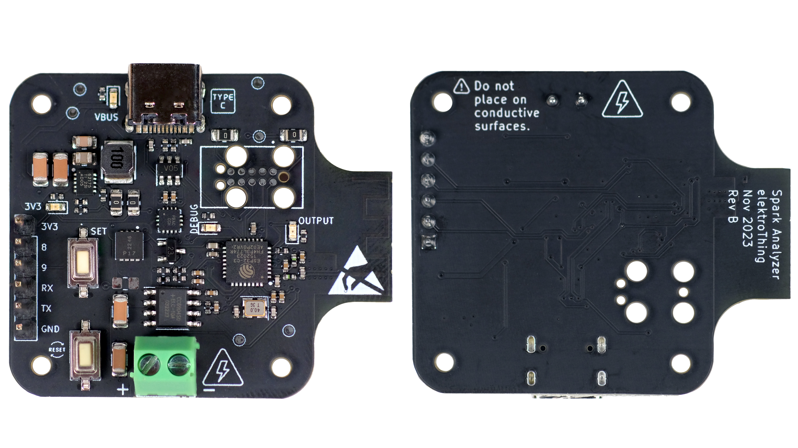
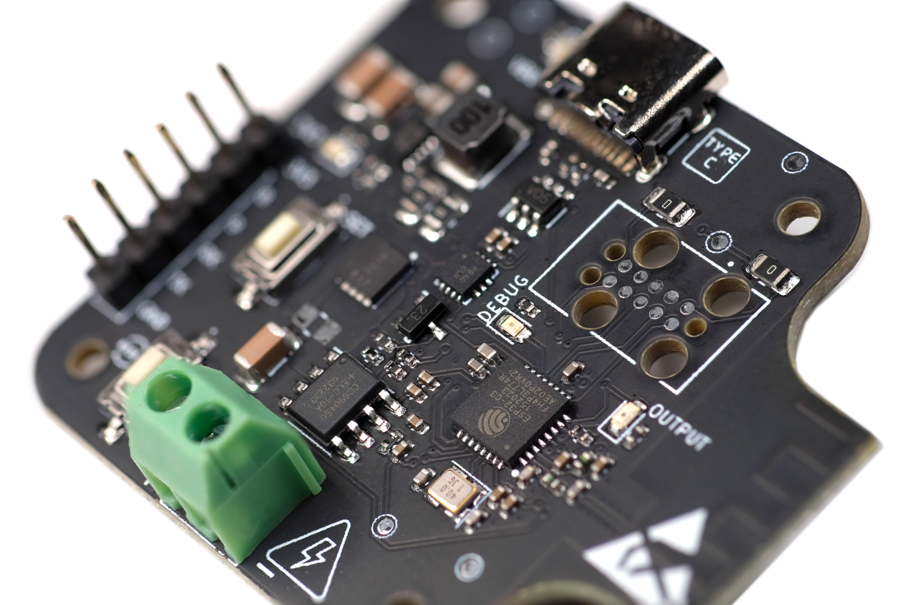
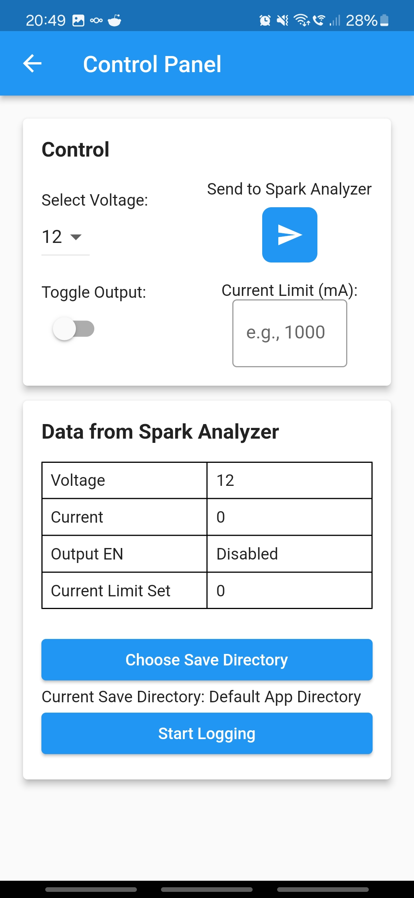
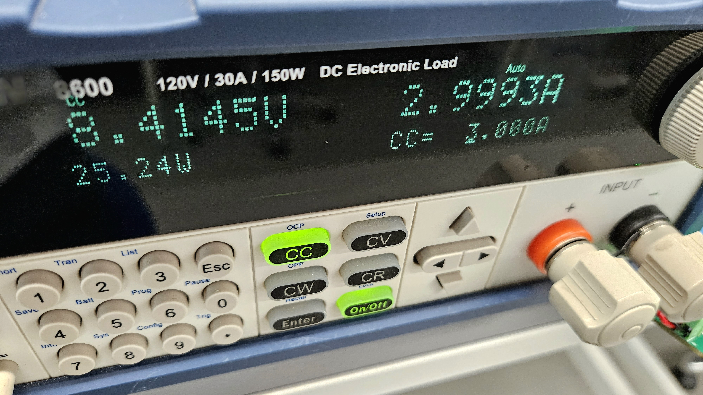
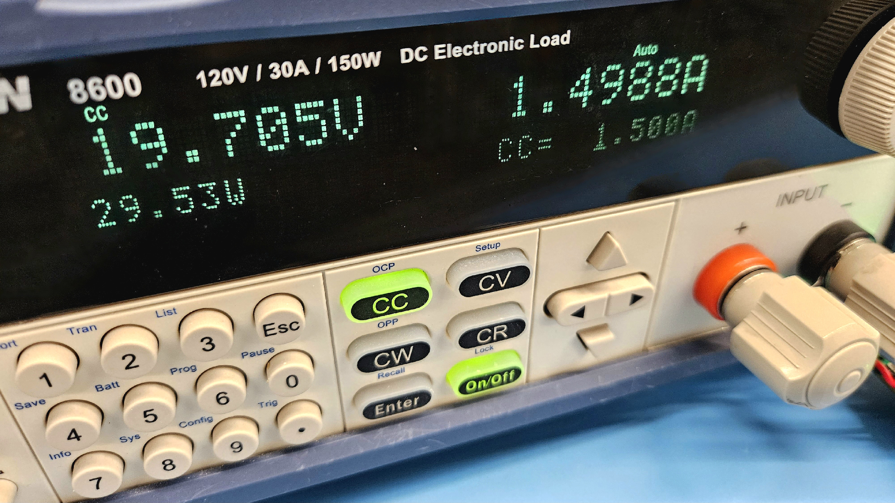
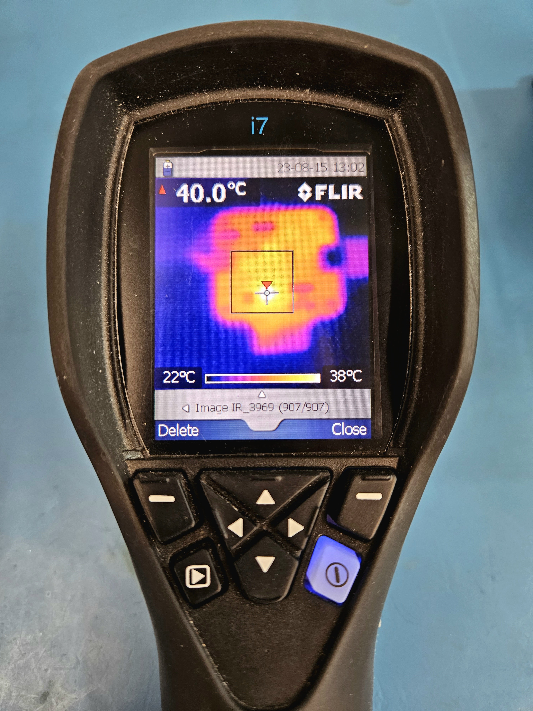

# Spark Analyzer: The Ultimate USB-C Power Delivery Analyzer & Power Supply

Live on Crowdsupply [now](https://www.crowdsupply.com/elektrothing/spark-analyzer).

**Spark Analyzer** is an innovative and versatile ESP32-powered USB-C Power Delivery (UCPD) compatible device designed to enhance the development and debugging process for projects and prototypes. This compact and sleek power supply and analyzer can be seamlessly integrated inline with existing setups, providing invaluable insights and control over power delivery.

With Spark Analyzer, developers can easily monitor and manipulate voltage levels, log data, and analyze power consumption, all through a convenient and intuitive interface on their smartphones. The device is equipped with both WiFi and BLE connectivity, enabling wireless control and logging, eliminating the need for clunky physical buttons and allowing for remote operation from a distance.

The sleek design of Spark Analyzer ensures it can be effortlessly attached to any existing UCPD compatible wall wart or power source, without requiring additional stands or tables. Its compact form factor guarantees flexibility and convenience, making voltage control and data logging accessible and hassle-free. 

## Features:

- **USB-C Power Delivery Compatibility**: Spark Analyzer is fully compatible with USB-C Power Delivery, ensuring compatibility with a myriad of devices and applications.
  
- **Wireless Control and Logging**: Say goodbye to physical buttons. With built-in WiFi and BLE, control and log data wirelessly using your smartphone.
  
- **Adjustable Voltage Output**: Precisely control voltage levels to suit your project's needs. Switchable to 5V, 9V, 15V, and 20V, 
   
- **Compact and Sleek Design**: Integrate Spark Analyzer effortlessly with your existing setups without the need for additional equipment.
  
- **Inline Integration**: Enhance convenience by integrating Spark Analyzer inline with UCPD compatible power sources.

- **IO Breakout**: Incorporate higher voltage into your existing projects with ease. Spark Analyzer features a separate 3.3V power domain.

- **Power Analyzer Capability**: Measure your project's current draw with precision. Understand your power needs and optimize accordingly.

- **Software Safety Cut-off**: No more worries about excessive current draw. Spark Analyzer's current sensing capability ensures the output FET is switched off during high current scenarios, safeguarding your equipment.

- **Output FET**: Toggle high voltage output on and off with the integrated output FET, providing you with more control over your power delivery.

- **Open Source Development**: Customize and expand Spark Analyzer's capabilities with its open-source nature. Dive deep into its functionalities and tailor it to your specific needs.

## Specifications:

### Power
- **Negotiable Power Delivery:** Options of 5 VDC, 9 VDC, 12 VDC, 15 VDC, 20 VDC; max 5 A (100 W at 20 VDC).
- **USB Type-C Port:** For power delivery and integrated JTAG programming.
- **ON Semiconductor [FUSB302MPX](https://www.onsemi.com/pdf/datasheet/fusb302b-d.pdf):** Programmable USB Type-C control and USB PD communication.
- **ESD Protection:** On D+/D-/CC1/CC2 pins.
- **Texas Instruments [TPS62175DQCT](https://www.ti.com/product/TPS62175/part-details/TPS62175DQCT):** 3.3 VDC 0.5 A max output DC-DC Step-Down Converter.
- **Power Output:** 3.5 mm, 2-position terminal block.

### I/O Configuration
- **GPIOs:** 4 GPIOs (I2C, UART, SPI compatible).
- **Power Pins:** 1x 5 VDC and 1x GND.

### Microcontroller
- **Model:** [ESP32-C3FH4](https://www.espressif.com/sites/default/files/documentation/esp32-c3_datasheet_en.pdf) with 40 MHz crystal.
- **Wi-Fi:** 802.11b/g/n.
- **Bluetooth:** BLE 4.2.
- **Flash Memory:** 4 MB.

### Interface
- **3x LED Indicators**
  - Power On
  - Output Enable
  - Programmable LED/Debug
- **Buttons**
  - Reset
  - Programmable Button/Debug

### Programming
- **Integrated JTAG Controller:** For programming.
- **USB-C:** Built-in USB JTAG programmer (ESP32-C3), compatible with Arduino. Select ESP32-C3 Dev Board.

### Output
- **Current Output:** [CC6904SO-10A](https://datasheet.lcsc.com/lcsc/2304140030_Cross-chip-CC6904SO-10A_C469389.pdf).
- **Current Sensor:** Hall Effect Current Sensor.
- **Output Enable:** [DMP3017SFG-7 FET](https://www.diodes.com/assets/Datasheets/products_inactive_data/DMP3017SFG.pdf).
  

## Features

- **USB-C Power Delivery Compatibility**: Fully compatible with USB-C Power Delivery, making it versatile for various devices and applications.

- **Wireless Control and Logging**: With built-in Wi-Fi and BLE, you can control and log data wirelessly using your smartphone, eliminating the need for physical buttons and allowing remote operation.

- **Adjustable Voltage Output**: Precisely control voltage levels with options for 5 VDC, 9 VDC, 15 VDC, and 20 VDC, catering to your project's specific needs.

- **Compact and Sleek Design**: Designed for inline integration, Spark Analyzer seamlessly attaches to UCPD compatible power sources without the need for additional equipment.

- **IO Breakout**: Incorporate higher voltage into your projects with ease, thanks to Spark Analyzer's separate 3.3 VDC power domain.

- **Power Analyzer Capability**: Measure your project's current draw with precision, enabling you to understand your power requirements better and optimize accordingly.

- **Software Safety Cut-off**: Ensures protection against excessive current draw by switching off the output FET during high current scenarios.

- **Output FET**: Provides control over the high voltage output, giving you more command over your power delivery.

- **Open Source Development**: Spark Analyzer is open source, allowing for customization and expansion of its capabilities. Dive into the [GitHub repo](https://github.com/tooyipjee/Spark-Analyzer/tree/master) for detailed documentation.

## Spark Analyzer Mobile App 

> **Note**: The Spark Analyzer Mobile App is currently in active development. The features described below are subject to change as we continue to improve the app.

The Spark Analyzer Mobile App, currently done for [Android](https://play.google.com/store/apps/details?id=com.elektrothing.SparkAnalyzer&hl=en&gl=US) (iOS support is available via [RemoteXY](https://apps.apple.com/us/app/remotexy/id1168130280), is the perfect companion to your Spark Analyzer device. It simplifies monitoring and controlling power delivery with these key features:

- **Voltage Selector**: Easily choose from different voltage levels (5 VDC, 9 VDC, 15 VDC, or 20 VDC) using a user-friendly selector.
- **Output Toggle**: Turn the power output on or off conveniently with a toggle switch.
- **Current Logging**: Save current draw as a .csv file.
- **Current Limit**: Ability to set a software current trip as a safety feature.
- **Read-time Display**: View current set point, current draw and output enable in real time on your phone. 

### Key Features:

- **Voltage Selector**: The app comes with a user-friendly voltage selector that allows you to easily choose from the different voltage levels supported by the UCPD protocol. Whether you need 5V, 9V, 15V, or 20V, switching between these options is just a tap away.

- **Output Toggle**: Need to turn the power output on or off? The app features a convenient toggle switch that gives you full control over the Spark Analyzer's output, making it simple to manage your device remotely.

- **Current Draw Chart**: Keep an eye on your project's power consumption with the app's real-time current draw chart. This feature provides a graphical representation of the current being drawn, helping you to monitor and optimize your power usage effectively.

### Future Developments:

The Spark Analyzer Mobile App is continuously being improved, with several new features in the pipeline. Upcoming updates will include the ability to export logs for further analysis, set current limits to prevent overcurrent scenarios, and much more.

## Testing for Performance

At the heart of Spark Analyzer's design is a commitment to reliability and performance. To ensure that Spark Analyzer stands up to real-world demands, we subjected it to testing under use conditions.

### Max Current Test: 3A at 9V
Under a load condition of 3A at 9V, Spark Analyzer showcased its robust power delivery capabilities without any hitches. 

### Max Voltage Test: 1.5A at 20V
Even at its maximum voltage output of 20V with a 1.5A load, Spark Analyzer continued to perform seamlessly, demonstrating its versatility and reliability.

### Thermal Performance
Safety and efficiency are paramount. We took a thermal image of the board under these testing conditions to ensure that all components remained within safe temperature limits. The results were impressive: the entire board stayed cool, with the warmest component being the ESP32 microcontroller, which only reached around 40°C.

These tests underscore Spark Analyzer's commitment to delivering a product that is not only feature-rich but also reliable, safe, and efficient. With Spark Analyzer, you're investing in a device that's been tried and tested to ensure optimal performance under all conditions.

## Package Contents:

- 1x Spark Analyzer
- Additional components (Specify as per your package)

## Manufacturing & Logistics:

Our designs have undergone rigorous testing and verification. We've already produced a pilot batch, and our manufacturing partners are geared up for full-scale production. All Spark Analyzer units will be shipped globally, ensuring timely delivery to our backers.

## Comparison: Spark Analyzer vs PD Micro vs Lab Power Supply

|    | Spark Analyzer               | [PD Micro](https://www.mouser.co.uk/ProductDetail/Crowd-Supply/CS-PDMICRO-01?qs=TuK3vfAjtkXixx0TeJooNQ%3D%3D)               | [TinyPICO V3](https://www.conrad.com/en/p/joy-it-com-zy12pdn-converter-1-pc-s-2475888.html?WT.srch=1&vat=true&utm_source=google&utm_medium=organic&utm_campaign=shopping&srsltid=AfmBOooPUzUXbytdxZNQd-7snqUbn7jtgCwQktmcI8B5WYmZAfE5yNWl4q0#productDownloads)          | [Joy-IT COM ZY12PDN](https://shop.pimoroni.com/products/tinypico-v2?variant=39285089534035)   |
|------------------------------|------------------------------|------------------------|----------------------|----------------------|
| **Microcontroller**          | ESP32-C3                     | ATmega32U4             | ESP32-PICO-D4        | Not Applicable       |
| **WiFi Connectivity**        | Available (802.11b/g/n)      | Not Available          | Available            | Not Available        |
| **Bluetooth Connectivity**   | Available (BLE 4.2)          | Not Available          | Available            | Not Available        |
| **Flash Memory**             | 4 MB                         | Not Specified          | 4 MB                 | Not Specified        |
| **USB-C Power Delivery**     | Supported                    | Supported              | Not Supported        | Supported            |
| **Output Control**           | Adjustable                   | Adjustable             | Not Specified        | Adjustable           |
| **Wireless Control**         | Yes                          | No                     | Yes                  | No                   |
| **Smartphone App Support**   | Yes                          | No                     | No                   | No                   |
| **Power Analysis**           | Accurate                     | Basic                  | Not Specified        | Basic                |
| **Design**                   | Compact and Sleek            | Compact                | Ultra-Small          | Compact              |
| **Open Source Status**       | Yes                          | Yes                    | Yes                  | No                   |
| **Programming Interface**    | USB + JTAG                   | USB                    | USB                  | Not Applicable       |
| **Inline Integration**       | Yes                          | No                     | Not Applicable       | No                   |
| Power Delivery Range         | 5-20 VDC Supported           | 5-20 VDC Supported     | Not Supported        | 5-20 VDC Supported   |
| **Price (USD)**              | $49                          | $28                    | $22                  | $16                  |

## License

MIT License

Copyright (c) 2023 elektroThing

Permission is hereby granted, free of charge, to any person obtaining a copy
of this software and associated documentation files (the "Software"), to deal
in the Software without restriction, including without limitation the rights
to use, copy, modify, merge, publish, distribute, sublicense, and/or sell
copies of the Software, and to permit persons to whom the Software is
furnished to do so, subject to the following conditions:

The above copyright notice and this permission notice shall be included in all
copies or substantial portions of the Software.

THE SOFTWARE IS PROVIDED "AS IS", WITHOUT WARRANTY OF ANY KIND, EXPRESS OR
IMPLIED, INCLUDING BUT NOT LIMITED TO THE WARRANTIES OF MERCHANTABILITY,
FITNESS FOR A PARTICULAR PURPOSE AND NONINFRINGEMENT. IN NO EVENT SHALL THE
AUTHORS OR COPYRIGHT HOLDERS BE LIABLE FOR ANY CLAIM, DAMAGES OR OTHER
LIABILITY, WHETHER IN AN ACTION OF CONTRACT, TORT OR OTHERWISE, ARISING FROM,
OUT OF OR IN CONNECTION WITH THE SOFTWARE OR THE USE OR OTHER DEALINGS IN THE
SOFTWARE.
