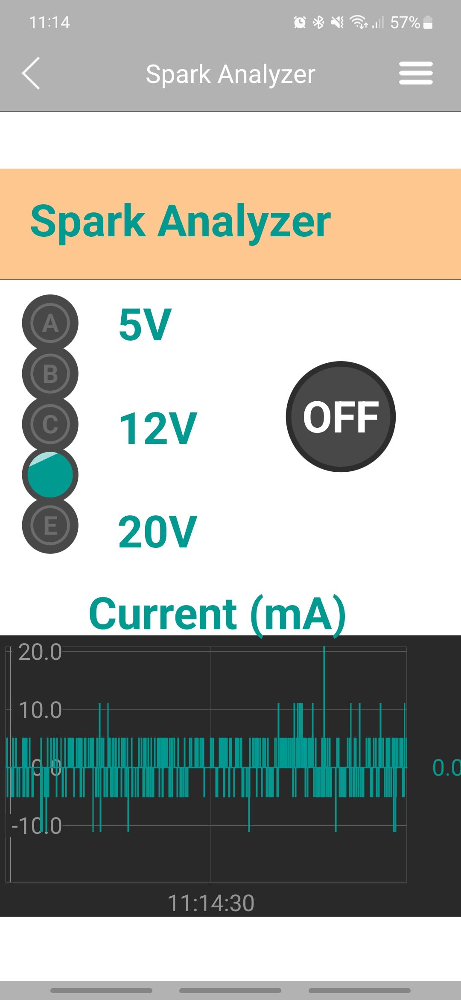

### Spark Analyzer Code Guide

#### Overview
The Spark Analyzer code is designed for a Bluetooth Low Energy (BLE) connected power supply controller. It allows remote monitoring and control of a power supply's voltage and current draw via the RemoteXY app. The code includes functionality for adjusting voltage, turning the power supply on and off, and monitoring current consumption.

#### How the Code Works

1. **Initialization**: Sets up BLE connectivity, preferences, and initializes the USB-C Power Delivery (PD) with pre-stored voltage settings.

2. **Remote Control Interface**: Implemented using the RemoteXY service, which provides a graphical user interface (GUI) on a smartphone for remote interaction.

3. **Voltage Control**: Allows the selection of output voltages (5V, 9V, 12V, 15V, 20V) via a selector on the RemoteXY app interface.

4. **On/Off Control**: Includes an on/off switch on the RemoteXY app to enable or disable the power output.

5. **Current Monitoring**: Measures and displays the current draw in milliamperes (mA) on the app.

6. **ADC Filtering**: Uses a moving average filter to smooth out the analog-to-digital converter (ADC) readings for accurate current measurements.

7. **Preferences Management**: Saves and retrieves user settings (like set voltage) using the ESP32's Preferences library.

#### How to Use with RemoteXY App

##### Installing RemoteXY App
1. **Android Devices**:
   - Open the Google Play Store.
   - Search for "RemoteXY: Arduino control".
   - Install the app.

2. **iOS Devices**:
   - Open the Apple App Store.
   - Search for "RemoteXY: Arduino control".
   - Download and install the app.

##### Connecting to Spark Analyzer
1. **Open the RemoteXY App** on your smartphone.

2. **Connect to the Device**:
   - In the app, select the connection mode (BLE).
   - Scan for available devices and select "Spark Analyzer".

3. **Interface Overview**:

   - **Voltage Selector (A to E)**: Select between 5V, 9V, 12V, 15V, and 20V. Labels indicate the corresponding voltages (5V, 12V, and 20V).
   - **On/Off Button**: A toggle switch to turn the power output on or off.
   - **Current Draw Chart**: Displays real-time current consumption in mA.

4. **Using the Interface**:
   - **Selecting Voltage**: Tap on the voltage selector (A to E) to choose the desired output voltage. Only select among the labeled voltages (5V, 12V, and 20V) for safety.
   - **Toggling Power**: Press the on/off button to enable or disable the power output.
   - **Monitoring Current**: View the current draw chart to see the live current consumption in milliamperes.

5. **Data Synchronization**: The app will continuously synchronize data with the Spark Analyzer, providing real-time updates on voltage and current readings.

#### Safety and Precautions
- Ensure that your power supply and hardware are compatible with the selected voltages and current levels.
- Use the app within the BLE range for stable communication.
- Regularly check connections and components for safety.

This guide assumes familiarity with basic electronic and BLE concepts. For specific hardware setup or advanced configurations, refer to the device's manual or technical documentation.